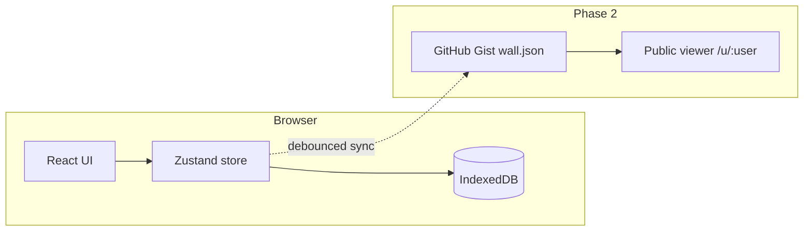

# Wall

**A living wall for the open web.** One canvas per person — drag stickers, photos, and links onto a fixed noticeboard, then share it as a link or a self-updating image embed.

## Quickstart

```bash
git clone <your-repo-url>
cd og-canvas-share
npm install
npm run dev
```

Open [http://localhost:5173](http://localhost:5173).

### Docker (production preview)

```bash
npm run docker:run
# → http://localhost:8080

npm run docker:stop
```

Or manually:

```bash
docker build -t wall .
docker run -p 8080:80 wall
```

## Routes

| Route | Status | Description |
|-------|--------|-------------|
| `/` | ✅ | Landing + interactive demo (memory-only) |
| `/edit` | ✅ | Full editor with toolbar, save, share |
| `/u/:username` | 🔜 Phase 2 | Public viewer (GitHub gist) |
| `/embed/:username` | 🔜 Phase 2 | Chrome-less embed |

## Phase 1 — implemented

| Feature | Status |
|---------|--------|
| 1600×1000 canvas + zoom/pan | ✅ |
| Text stickies, images, link cards | ✅ |
| Drag / resize / rotate (zoom-aware) | ✅ |
| Shift+drag snap-to-grid | ✅ |
| ⌘+drag proportional resize | ✅ |
| 8 themes | ✅ |
| IndexedDB persistence | ✅ |
| Undo / redo, duplicate, delete | ✅ |
| Right-click context menu | ✅ |
| Share modal (Link + Download tabs) | ✅ |
| PNG + JSON export | ✅ |
| Keyboard help overlay (⌘/) | ✅ |
| Landing demo + example wall cards | ✅ |
| PWA manifest | ✅ |
| Docker deployment | ✅ |

## Phase 2+ — not yet built

GitHub OAuth, gist sync, public viewer, live PNG/SVG, reactions, QR tab, AI assistant, command palette, time machine, embed/video/drawing elements, service worker, sticker packs, templates, Deno render endpoint, GitHub Action template.

See [Project status](#project-status) below for the full file checklist.

## Keyboard shortcuts

| Shortcut | Action |
|----------|--------|
| ⌘/Ctrl + Z | Undo |
| ⌘/Ctrl + Shift + Z | Redo |
| ⌘/Ctrl + S | Save to IndexedDB |
| ⌘/Ctrl + D | Duplicate selected |
| ⌘/Ctrl + / | Help overlay |
| Shift + drag | Snap to grid |
| ⌘/Ctrl + drag handle | Proportional resize |
| Delete / Backspace | Delete selected |
| Escape | Deselect / close modals |
| Right-click element | Context menu |

## Architecture



**Local-first:** edits update Zustand immediately, then debounce to IndexedDB (~500ms). Demo canvas (`id: demo`) never writes to storage.

## Deploy to GitHub Pages

```bash
# For project sites: username.github.io/repo-name/
VITE_BASE=/og-canvas-share/ npm run build
npm run deploy

# For root domain
npm run deploy
```

## Project status

### Present in repo

```
src/app/          Landing, Editor, PublicViewer*, EmbedView*, routes
src/canvas/       Canvas, CanvasElementView, TextSticky, ImageElement, LinkCard
src/store/        canvas.store.ts, ui.store.ts
src/persist/      db.ts, constants.ts
src/render/       exportPng.ts
src/themes/       index.ts (8 themes)
src/ui/           Toolbar, ShareModal, ContextMenu, HelpOverlay
src/lib/          cn, compress-image, extract-link-meta, canvas-coords, platform
public/           favicon.svg, manifest.webmanifest
Dockerfile        nginx static serve
```

\* PublicViewer and EmbedView are route stubs until Phase 2.

### Planned (spec layout, not yet created)

`github/`, `ai/`, `widgets/`, `persist/sync.ts`, `persist/snapshots.ts`, element types (embed, video, audio, drawing, qr, emoji, widget), `render-action/`, `server/render.ts`, `public/templates/`, `public/sticker-packs/`, service worker.

## Adding a theme

Add an entry in `src/themes/index.ts` and extend `ThemeId` in `src/types/canvas.ts`.

## License

MIT
